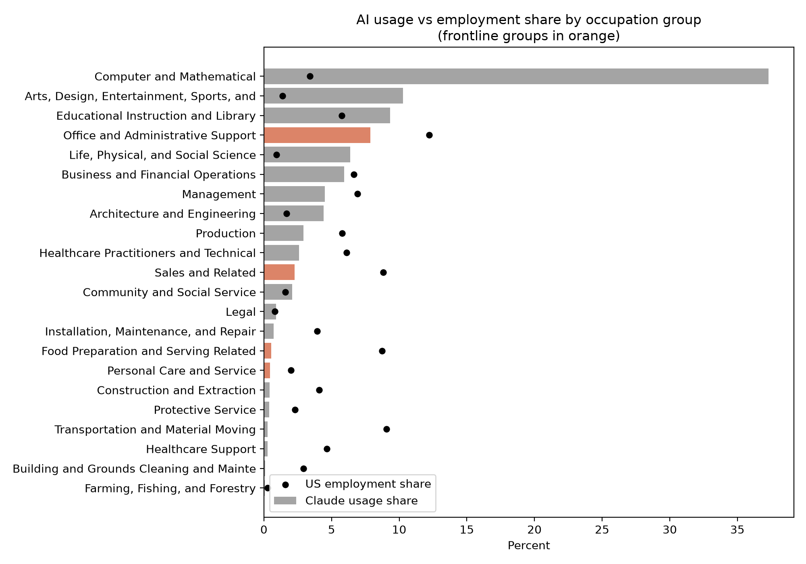
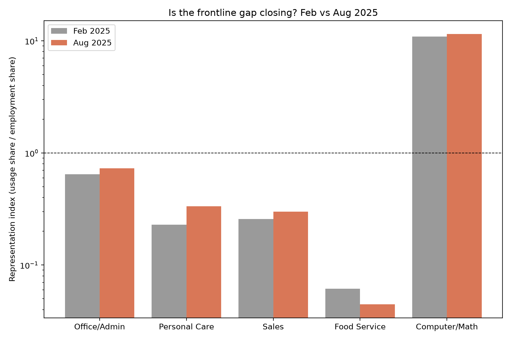
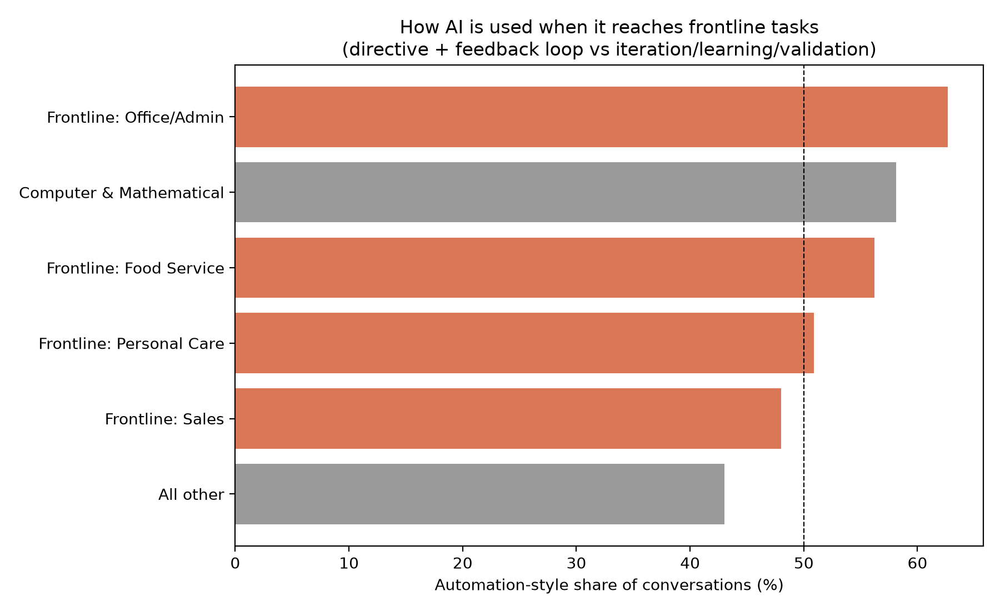
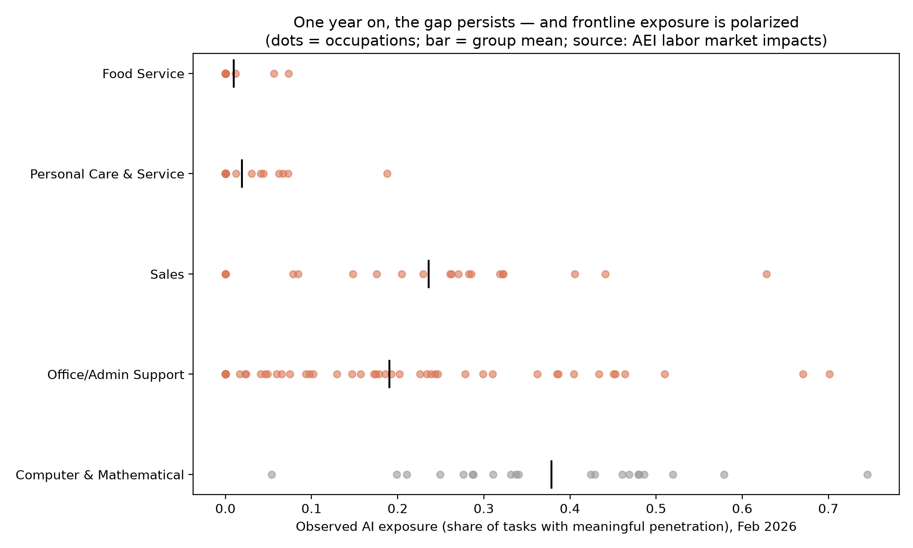

# The Frontline Exposure Gap

## Where AI is actually showing up in the U.S. labor market

**Working paper by Sriramkrishnan Nandhakumar**  
Boston University Questrom School of Business, MBA 2026

[Read the paper](paper/paper.pdf) · [Paper source](paper/paper.md) · [Methodology](docs/methodology.md) · [Reproducibility record](docs/reproducibility.md)



Most research on generative AI asks what the technology *could* do. This project asks a different question:

> **Where is AI actually being used, and which workers are still missing from that adoption?**

The answer is uneven. Sales, office and administrative support, food service, and personal care employ nearly one-third of U.S. workers, but account for only about one-ninth of task-matched Claude usage.

This is not a paper about whether AI will eventually affect frontline work. It is a measurement study of where adoption appears today, what kinds of frontline tasks receive it, and how that use differs from the patterns seen in professional and technical occupations.

---

## Why I studied this

While operating Krishna Foods and Energy, I saw the divide firsthand.

Demand forecasting, supplier comparisons, pricing, customer correspondence, and management reporting could be digitized and increasingly supported by AI. Packing, stocking, serving customers, supervising production, and resolving quality problems on a live factory floor were physical, time-sensitive, and much harder to mediate through a chat interface.

The task-level data reproduce that same divide. AI appears first in the information-processing tasks embedded inside frontline occupations. The in-person core of the work remains largely absent.

---

## Results at a glance

| Measure | Result |
|---|---:|
| Frontline share of U.S. employment | **31.7%** |
| Frontline share of task-matched AI usage | **11.1%** |
| Raw office and administrative support index | **0.65** |
| Corrected office and administrative support index | **0.34** |
| Food-service representation index | **0.06** |
| Computer and mathematical representation index | **10.94** |
| Automation-style share in frontline administrative use | **62.7%** |
| Automation-style share in other occupations | **43.0%** |
| Frontline occupations with zero observed exposure in February 2026 | **44 of 112** |

The representation index is:

```text
occupation group's share of AI usage
------------------------------------
occupation group's share of employment
```

An index of 1 means usage is proportional to employment. Values below 1 indicate underrepresentation.

---

## What the paper finds

### 1. Frontline workers are strongly underrepresented in observed AI use

The four frontline occupation groups jointly account for **31.7% of employment but only 11.1% of task-matched usage**.

| Occupation group | Raw representation index | After taxonomy correction |
|---|---:|---:|
| Office and administrative support | 0.64 | **0.34** |
| Sales and related | 0.26 | 0.26 |
| Personal care and service | 0.23 | 0.23 |
| Food preparation and serving | 0.06 | 0.06 |
| Computer and mathematical | 10.94 | 10.94 |

In per-worker terms, retail sales work appears in the usage data at roughly **one-fortieth the rate of software work**. Food-service work appears at roughly **one-hundred-eightieth the rate**.

### 2. Occupational taxonomy initially hides part of the gap

The raw administrative-support estimate is inflated by four technical occupations stored under historical clerical codes:

- Bioinformatics Technicians
- Computer Operators
- Statistical Assistants
- Desktop Publishers

Removing them reduces the administrative-support index from **0.645 to 0.338**. The other frontline estimates move by no more than 0.01.

This matters because a classification artifact can make frontline adoption look stronger than it is.

### 3. Wages do not explain most of the pattern

Among 585 occupations with positive observed usage and wage data, the baseline estimated wage elasticity of usage is **0.38**, with an HC1 robust standard error of **0.19**.

Adding a frontline indicator produces a frontline coefficient of **0.19**, with a robust standard error of **0.19**. It is statistically indistinguishable from zero. The models explain only about **3%** of cross-occupation variation in usage.

The evidence is therefore more consistent with a **per-worker adoption deficit** than with a simple low-wage occupation penalty. Frontline occupations are large, but observed usage does not scale with the number of people employed in them.

### 4. The gap did not clearly close during 2025

Between the February and August 2025 releases:

- office and administrative support rose from 0.65 to 0.73;
- sales rose from 0.26 to 0.30;
- personal care rose from 0.23 to 0.34;
- food service fell from 0.061 to 0.045;
- computer and mathematical occupations rose from 10.94 to 11.48.

No frontline group approached parity.

The two releases use different task universes and classification pipelines, so this is **suggestive evidence of persistence**, not a formal panel estimate.



### 5. Frontline AI use is more automation-oriented

Conditional on appearing in the usage data, frontline tasks are more likely to involve delegation rather than collaboration.

Automation-style interactions account for:

- **62.7%** of frontline office and administrative support use;
- **56.2%** of food-service use;
- **50.9%** of personal-care use;
- **48.0%** of sales use;
- **43.0%** of use across other occupations.

Automation-style interactions combine directive and feedback-loop conversations. Augmentation-style interactions include iteration, learning, and validation.

This distinction matters because experimental work links full delegation during skill acquisition with weaker learning outcomes. The paper does not claim that the two datasets measure the same behavior, but the comparison raises an important human-capital question: workers receiving less AI access may also receive a form of access that is less conducive to skill formation.



### 6. Frontline exposure is polarized by task medium

The February 2026 cross-section shows that frontline work is not uniformly unexposed.

Screen-mediated service occupations can be highly exposed:

- Customer Service Representatives: **0.70**
- Data Entry Keyers: **0.67**
- Retail Salespersons: **0.32**

Physically co-present occupations remain close to zero:

- Cashiers: **0.08**
- mean personal-care exposure: **0.02**
- mean food-service exposure: **0.01**

Customer Service Representatives score above Software Developers at 0.29 and close to Computer Programmers at 0.75. At the same time, **44 of 112 frontline occupations**, including all cook categories, waiters, and bartenders, register zero observed exposure.

The dividing line is not simply pay or occupational prestige. It is whether the task can be mediated through a screen.



---

## Why this matters

Productivity studies often estimate the effect of AI after a tool has already been deployed. Those gains can be large, especially for less-experienced workers.

But gains conditional on deployment do not answer the distributional question.

If adoption is concentrated in technical and screen-based occupations, AI can equalize performance within exposed jobs while widening differences between workers who receive useful access and workers who do not.

The paper points to two policy and product-design questions:

1. **Access:** Are frontline workers receiving employer-provided tools, devices, training, and redesigned workflows at the point of work?
2. **Interaction design:** Does AI help workers reason through tasks and build skills, or does it mainly encourage full delegation?

The strongest frontline-adjacent productivity evidence comes from an employer-provided assistant integrated into an existing workflow. That suggests deployment design and organizational complements matter as much as model capability.

---

## Data

The analysis combines:

- Anthropic Economic Index task-level usage data from February 2025;
- the V3 release covering an August 2025 usage window;
- O*NET task statements, occupation codes, and wage data;
- BLS Occupational Employment and Wage Statistics for May 2023;
- Anthropic's February 2026 occupation-level observed-exposure measure.

The task-level releases map millions of Claude conversations to O*NET task statements using a privacy-preserving aggregation pipeline. The 2026 exposure measure is a separate coverage metric and is treated as a complementary cross-section, not as a direct continuation of the 2025 usage series.

---

## Empirical approach

The study is descriptive. It estimates population shares, representation ratios, conditional interaction-mode shares, and occupation-level associations.

The occupation-level model is:

```text
log(occupation usage share)
    = constant
    + log(median wage)
    + frontline indicator
    + error
```

OLS estimates use **HC1 heteroskedasticity-robust standard errors**.

The measurement audit addresses four main threats:

- occupational misclassification within SOC codes;
- task statements assigned to multiple occupations;
- small conversation cells in interaction-mode estimates;
- selection into Claude rather than other AI platforms.

A task-splitting robustness check leaves every frontline representation index unchanged to three decimal places. The computer and mathematical index moves only from 10.944 to 10.918.

---

## What the paper does not claim

- It does not estimate a causal effect of AI on employment or wages.
- Claude usage is not representative of all generative AI use.
- User occupation is inferred from task content rather than observed directly.
- Conversation share is not the same as work-time share or productivity.
- Employer-deployed systems may be underrepresented in consumer conversation logs.
- The February and August 2025 releases are not a methodologically consistent panel.
- The February 2026 group means are unweighted across occupations unless detailed employment weights are supplied.

Platform selection likely inflates the level of the headline gap. It is less able to explain the within-frontline polarization, the taxonomy correction, or the interaction-mode differences observed within the same platform.

---

## Reproduce the analysis

Python 3.12 was used for the verified run.

```bash
git clone https://github.com/raamnandhakumar-eng/polecoai.git
cd polecoai

python -m venv .venv
source .venv/bin/activate          # Windows: .venv\Scripts\activate
python -m pip install --upgrade pip
python -m pip install -e ".[dev]"

make reproduce
```

Run each stage separately:

```bash
python scripts/download_data.py
python scripts/run_analysis.py
python scripts/run_extensions.py
python scripts/run_robustness.py
python scripts/run_latest_exposure.py
python tests/test_reported_results.py
python scripts/build_paper.py
```

For a download-free code check:

```bash
python tests/test_smoke.py
```

Generated tables and figures are committed so the reported results can be inspected without rerunning the full pipeline. Raw and intermediate source data are not committed.

---

## Repository map

```text
src/polecoai/    reusable analysis, data, regression, and plotting functions
scripts/         executable analysis and paper-build commands
data/            provenance records and ignored raw/processed data
results/tables/  generated CSV tables reported in the paper
figures/         generated publication figures
paper/           current paper source and PDF
docs/            methodology, data dictionary, and reproducibility record
tests/           smoke tests and reported-result assertions
```

---

## Future research

The paper identifies three extensions:

- build a methodologically consistent adoption panel across AEI releases;
- estimate a two-part model separating entry into observed use from usage intensity;
- distinguish worker adoption from managerial or supervisory use of frontline-classified tasks.

Each extension can be implemented with public occupational data and more complete release-level usage files.

---

## Citation

> Nandhakumar, S. (2026). *The Frontline Exposure Gap: Evidence on AI Adoption in Retail and Service Occupations from Task-Level Usage Data*. Working paper. https://github.com/raamnandhakumar-eng/polecoai

Citation metadata are also available in [CITATION.cff](CITATION.cff).

## License and data attribution

Code is released under the [MIT License](LICENSE). Source datasets retain their original licenses. Anthropic Economic Index data are distributed under CC BY 4.0.

This project uses public data from the Anthropic Economic Index, the U.S. Bureau of Labor Statistics, and the U.S. Department of Labor's O*NET program. Their inclusion does not imply endorsement of this analysis.
