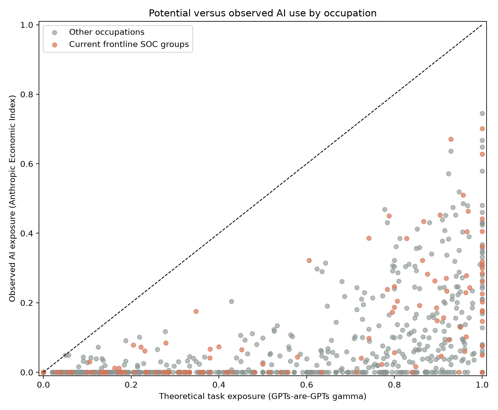
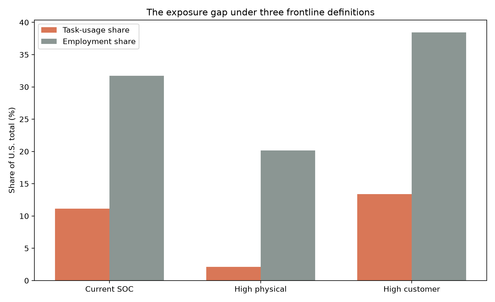

# The Frontline Exposure Gap: Evidence on AI Adoption in Retail and Service Occupations from Task-Level Usage Data

**Sriramkrishnan Nandhakumar**

## Abstract

This project studies how observed generative-AI use is distributed across U.S.
occupations. Version 1 shows that frontline occupations account for **31.7% of
employment but only 11.1% of observed task-matched AI usage**. Version 2 extends
the analysis by separating the extensive margin of adoption from usage
intensity, testing two O*NET-based definitions of frontline work, and comparing
theoretical task exposure with observed use. Computer use is positively
associated with adoption, while physical presence is negatively associated
with both adoption and conditional usage intensity. The evidence is
occupation-level and descriptive. It does not identify causal effects on
employment, wages, productivity, or access.

> **Version note:** The DOI, online paper, and PDF refer to **Version 1**.
> **Version 2** is a reproducible research extension in this repository. It
> preserves the Version 1 paper and its headline results.

## Paper: Version 1

- **Preprint and DOI:** https://doi.org/10.5281/zenodo.21522366
- **Read online:** https://raamnandhakumar-eng.github.io/polecoai/
- **PDF:** [`paper/paper.pdf`](paper/paper.pdf)
- **Status:** Sole-authored working paper
- **JEL codes:** J23, J24, O33

The original Version 1 repository snapshot is preserved at
[`version-1-snapshot`](https://github.com/raamnandhakumar-eng/polecoai/tree/version-1-snapshot).

## Research question

How does realized AI adoption compare with the economic importance of
frontline work?

The extension asks three related questions:

1. Which occupations register any observed AI use?
2. Conditional on positive use, which occupations use AI more intensively?
3. Where is theoretical task exposure high relative to observed adoption?

## Contribution

The project makes four descriptive contributions:

1. It measures occupational representation in AI usage relative to employment.
2. It audits the occupational taxonomy and tests shared-task assignments.
3. It separates the extensive and intensive margins of observed adoption.
4. It constructs a potential-versus-observed benchmark to identify possible
   diffusion frictions.

## Data

| Source | Use in the analysis |
|---|---|
| Anthropic Economic Index, February 2025 | Task-level AI usage matched to O*NET-SOC occupations |
| Anthropic Economic Index, August 2025 | Cross-release comparison and collaboration modes |
| Anthropic AI Exposure Index, March 2026 | Occupation-level observed exposure for Version 2 |
| O*NET 30.2 | Education, computer use, physical presence, and customer interaction |
| May 2023 OEWS | Employment shares and occupation-level wage controls |
| GPTs-are-GPTs | Theoretical task-exposure benchmark |

The pipeline verifies the pinned Version 2 source files with SHA-256 hashes.
See [`docs/methodology.md`](docs/methodology.md) for construction details and
[`docs/checks.md`](docs/checks.md) for reported-result checks.

## Empirical strategy

### Version 1: Representation and wage gradient

For occupation group $g$, the representation index is

$$
R_g = \frac{s_g^U}{s_g^E},
$$

where $s_g^U$ is the group's share of task-matched AI usage and $s_g^E$
is its share of national employment. A value below one indicates
underrepresentation in observed AI use.

The occupation-level wage specification is

$$
\log(s_o^U) =
\alpha + \beta \log(w_o) + \gamma Frontline_o + \varepsilon_o.
$$

The wage regression uses 585 occupations with positive usage and wage data.
Standard errors use the HC1 heteroskedasticity correction.

### Version 2: Extensive and intensive margins

The first stage estimates whether occupation $o$ has any observed AI use:

$$
\Pr(Observed_o > 0) =
F(\alpha + X_o'\beta).
$$

The second stage estimates usage intensity among occupations with positive use:

$$
\log(Observed_o \mid Observed_o > 0) =
\alpha + X_o'\beta + \varepsilon_o.
$$

The covariates are log wage, current frontline status, required education,
computer use, and physical presence. Continuous predictors are standardized.
The first-stage logit uses 732 occupations. The second-stage OLS model uses 333
occupations. Both report HC1 standard errors. This is a descriptive two-part
model, not a Heckman selection model.

### Version 2: Alternative frontline definitions

The extension compares three definitions:

- **A. Current SOC definition:** Sales, Office and Administrative Support, Food
  Preparation and Serving, and Personal Care and Service.
- **B. Physical-presence definition:** occupations in the top quartile of the
  O*NET physical-presence index.
- **C. Customer-facing definition:** occupations in the top quartile of the
  O*NET customer-facing index.

### Version 2: Potential versus observed use

The extension defines

$$
AccessGap_o =
TheoreticalExposure_o - ObservedExposure_o.
$$

The gap regression includes log wage, frontline status, education, computer
use, physical presence, and customer interaction. Because the theoretical and
observed measures use different task universes and methods, this variable is a
benchmark. It is not a literal measure of denied workplace access.

## Main results

### Version 1

| Occupation group | Usage share | Employment share | Representation index |
|---|---:|---:|---:|
| Office and Administrative Support | 7.87% | 12.20% | 0.64 |
| Sales and Related | 2.27% | 8.81% | 0.26 |
| Personal Care and Service | 0.46% | 2.00% | 0.23 |
| Food Preparation and Serving | 0.53% | 8.72% | 0.06 |
| **Four frontline groups** | **11.13%** | **31.74%** | **0.351** |

Additional Version 1 results:

- Excluding four technical occupations classified under administrative-support
  codes reduces that group's representation index from **0.645 to 0.338**.
- The estimated wage elasticity of usage is **0.384**, with an HC1 standard
  error of **0.185**.
- Dividing shared tasks across every linked occupation leaves the four
  frontline representation indices unchanged to three decimal places.

### Version 2

| Predictor | Any-use average marginal effect | Log usage, conditional on positive use |
|---|---:|---:|
| Log annual mean wage | -0.008 | 0.046 |
| Current frontline SOC group | 0.129 | 0.449 |
| Required education | 0.014 | -0.016 |
| Computer use | **0.167** | **0.181** |
| Physical presence | **-0.104** | **-0.544** |

Computer use is positively associated with both the probability and intensity
of observed use. Physical presence is negatively associated with both. Wage
and education are not statistically distinguishable from zero in these
specifications.

The conditional frontline coefficient does not reverse the unconditional
headline gap. It compares occupations with similar wage, education, computer
use, and physical-presence measures.

| Frontline definition | Usage share | Employment share | Representation index |
|---|---:|---:|---:|
| Current four SOC groups | 11.13% | 31.74% | **0.351** |
| High physical presence | 2.10% | 20.17% | **0.104** |
| High customer interaction | 13.39% | 38.45% | **0.348** |

Underrepresentation persists across all three definitions. In the access-gap
regression, a one-standard-deviation increase in computer use is associated
with a **0.135** larger theoretical-minus-observed gap. Customer interaction is
associated with a **0.030** larger gap. These estimates identify occupations
for further study, not causal access barriers.

See [`docs/v2_extension.md`](docs/v2_extension.md) for the complete Version 2
estimates and interpretation.

## Figures

### Potential versus observed AI use



Points below the diagonal have less observed use than the theoretical benchmark.

### Representation under three frontline definitions



The observed exposure gap persists under the current SOC, physical-presence,
and customer-facing definitions.

## Interpretation

The results are consistent with uneven occupational diffusion. Observed AI use
is concentrated in screen-mediated work, while physically present work has a
lower probability and intensity of use. The potential-versus-observed benchmark
also identifies computer-intensive and customer-facing occupations where
modeled capability exceeds observed penetration.

These patterns may reflect task suitability, device access, employer adoption,
workflow design, worker training, or measurement differences. Occupation-level
data cannot distinguish among these mechanisms.

## Policy relevance

If productivity gains depend on access to useful AI tools, uneven workplace
diffusion could widen productivity and wage differences. The results motivate
focused evaluation of:

- employer-provided AI access at the point of work;
- role-specific worker training;
- workflow redesign centered on augmentation;
- devices and digital infrastructure for frontline settings; and
- deployment rules that preserve worker judgment and skill development.

The current evidence does not estimate the effects of these interventions.
Employer-level or worker-level research is needed.

## Reproduce

```bash
git clone https://github.com/raamnandhakumar-eng/polecoai.git
cd polecoai
python -m venv .venv
source .venv/bin/activate          # Windows: .venv\Scripts\activate
python -m pip install --upgrade pip
python -m pip install -e ".[dev]"
make reproduce
```

The first run downloads the source data. Generated tables are written to
`results/tables/`, figures to `figures/`, and the rebuilt Version 1 paper to
`paper/paper.pdf`.

Run the reported-result checks with:

```bash
python tests/test_reported_results.py
python -m pytest -q
```

## Repository structure

```text
data/             Downloaded inputs, processed files, and pinned reference data
src/polecoai/     Analysis modules
scripts/          Download and rebuild commands
results/tables/   Generated estimates and summary tables
figures/          Generated figures
paper/            Version 1 paper website source and PDF
docs/             Methodology, findings, checks, and Version 2 notes
tests/            Reproduction and estimator checks
```

## Robustness and validation

The repository includes:

- a SOC taxonomy audit;
- shared-task splitting;
- February-to-August 2025 comparisons;
- occupation-level wage regressions;
- the Version 2 two-part model;
- three frontline definitions;
- the access-gap regression; and
- direct assertions for reported numeric results.

## Limitations

- The usage data reflect Anthropic products, not all generative-AI use.
- Occupations are inferred from task content rather than observed from users.
- Conversation share is not work-time share, productivity, or welfare.
- The February and August 2025 releases do not form a consistent panel.
- Employer-deployed AI may be underrepresented in consumer conversation data.
- The theoretical and observed exposure measures use different task universes.
- Top-quartile O*NET definitions remain researcher choices.
- The analysis does not identify causal effects on employment, wages, skills,
  productivity, or access.

## Citation for Version 1

```bibtex
@techreport{nandhakumar2026frontline,
  author = {Nandhakumar, Sriramkrishnan},
  title = {The Frontline Exposure Gap: Evidence on AI Adoption in Retail and Service Occupations from Task-Level Usage Data},
  year = {2026},
  type = {Working paper},
  doi = {10.5281/zenodo.21522366},
  url = {https://doi.org/10.5281/zenodo.21522366}
}
```

GitHub also reads [`CITATION.cff`](CITATION.cff) and provides a **Cite this
repository** menu.

## License

- Code: [MIT](LICENSE)
- Manuscript text and original figures: [CC BY 4.0](LICENSE-CONTENT.md)
- Third-party data retain their original terms.

## Contact

Raam Nandhakumar: raam.nandhakumar@gmail.com
